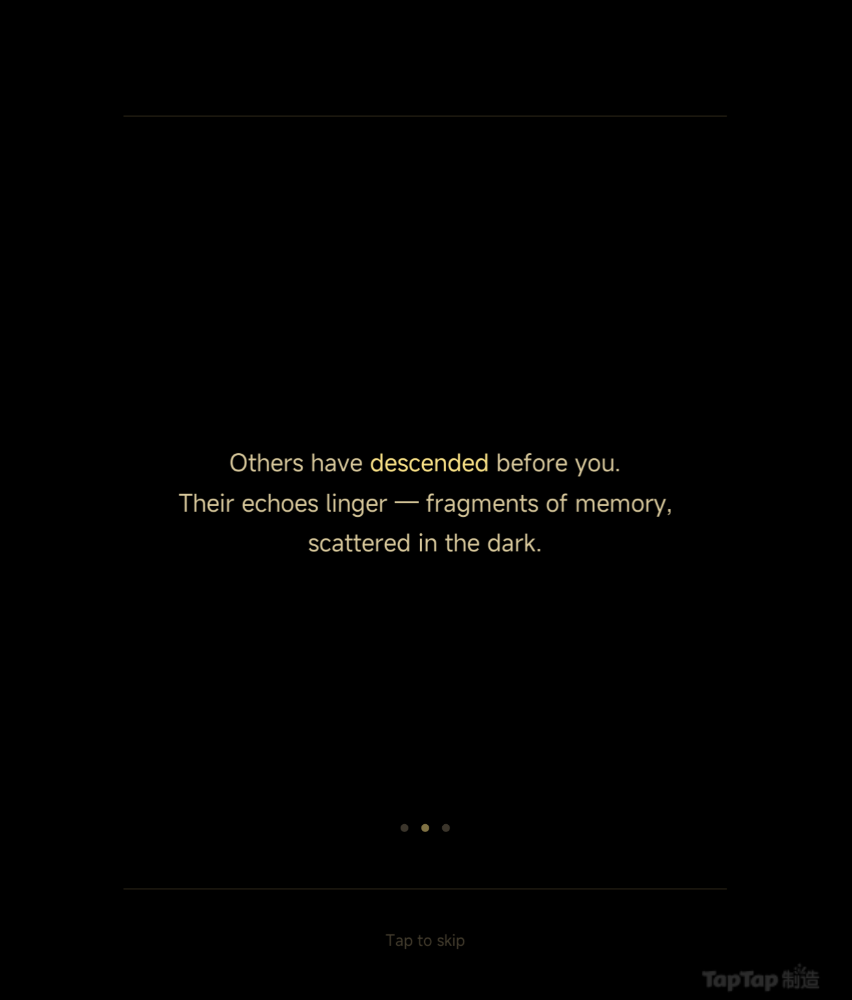
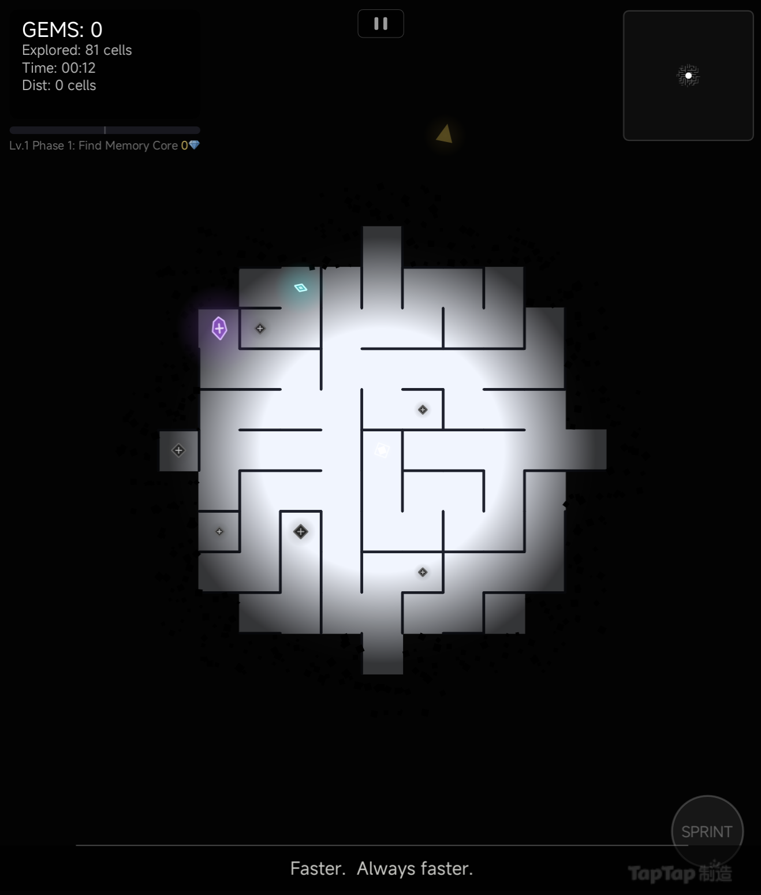
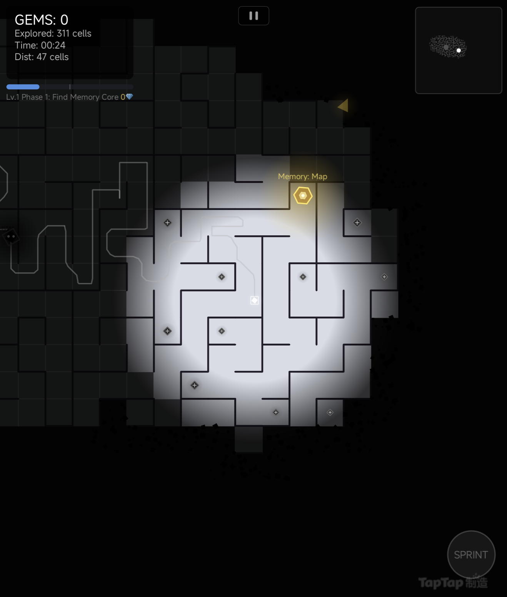
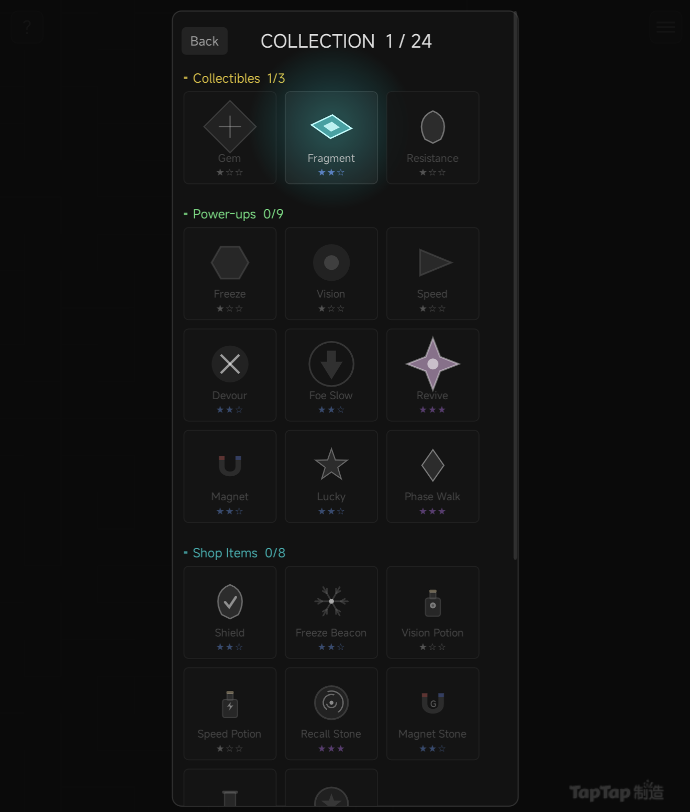
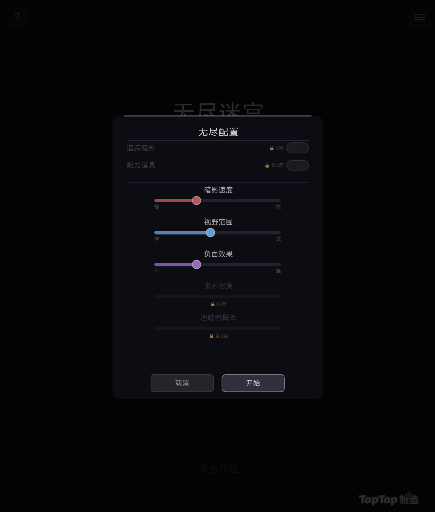

# 无尽迷宫 (Infinite Maze)

> 🎮 **在线试玩**：[TapTap 测试版](https://maker.taptap.cn/shares/8yqmgx)

> 在无尽的黑暗迷宫中探索、收集、生存——一款融合 Roguelike 元素的程序化生成迷宫冒险游戏。

<table>
<tr>
<td></td>
<td></td>
<td></td>
</tr>
<tr>
<td></td>
<td></td>
<td></td>
</tr>
</table>

## 游戏概览

《无尽迷宫》是一款暗黑风格的 2D 迷宫探索生存游戏。玩家置身于无限延展的程序化迷宫中，通过摇杆（或键盘）控制角色在黑暗中穿行，收集散落的宝石与记忆碎片，同时躲避沿足迹追踪而来的暗影实体。

游戏拥有两种核心模式：**坠落模式**提供包含 4 章 8 关的叙事体验，玩家逐步解锁冲刺、破墙、穿墙等能力，在越来越危险的深层迷宫中推进剧情；**无尽模式**则剥离所有道具系统，考验纯粹的操作与决策能力，挑战生存极限。

迷宫世界基于 Chunk 动态加载，玩家探索到哪里，世界就生成到哪里——真正的"无尽"体验。雾气遮盖未探索区域，视野有限，每一步都充满未知。

## 核心玩法

### 探索与收集
- **无限程序化迷宫**：基于 Chunk 系统无缝加载，迷宫永远不会走到尽头
- **宝石收集**：散落在死路尽头的宝石是核心得分资源
- **记忆碎片**：20 个叙事性收集品，揭示迷宫深处的故事
- **图鉴系统**：收集所有道具和效果的百科全书，含稀有度分级

### 生存与威胁
- **暗影追踪**：一个黑暗实体沿着玩家走过的路径追踪，被追上即死
- **追踪者(Tracker)**：使用 A* 寻路的二级敌人，直接向玩家逼近
- **负面效果**：致盲、减速、眩晕、暗影加速——迷宫深处的诅咒
- **深度层级**：越深入，视野越窄、暗影越快、资源越稀缺

### 成长与策略
- **9 种道具**：加速、护盾、磁石、冰冻、幻影、时间回溯、光明、急停、传送
- **商店系统**：用宝石购买道具，策略性资源分配
- **碎片升级**：每收集一个碎片永久提升视野 (+12%)、速度 (+6%)、抗性 (+5%)
- **冲刺机制**：有限的体力条，冲刺可甩开追踪但需冷却恢复

### 双模式设计
| 模式 | 特色 | 定位 |
|------|------|------|
| **坠落 (Descent)** | 叙事 + 道具 + 商店 + 关卡 | 策略型玩家 |
| **无尽 (Endless)** | 纯操作，无道具 | 硬核生存挑战 |

## 技术实现

### 引擎与框架
- **引擎**：UrhoX（Lua 脚本）
- **渲染**：NanoVG 2D 矢量图形（全自绘管线）
- **音频**：分层 BGM 系统 + SFX 对象池
- **存档**：本地 JSON 持久化 + clientCloud 云端排行榜
- **平台**：支持移动端触控（虚拟摇杆）和 PC 键鼠

### 技术亮点

#### 1. 确定性程序化生成

迷宫使用 xorshift 伪随机数生成器配合种子哈希，保证相同 Chunk 坐标永远生成相同迷宫结构：

```lua
-- 确定性种子：世界种子 + Chunk坐标 → 唯一种子
local function hashSeed(baseSeed, cx, cy)
    local h = baseSeed
    h = h ~ (cx * 374761393)
    h = h ~ (cy * 668265263)
    h = (h ~ (h >> 13)) * 1274126177
    return h ~ (h >> 16)
end
```

递归回溯算法生成迷宫骨架，再通过 Chunk 边界联通算法确保相邻 Chunk 无缝衔接。

#### 2. A* 寻路与二叉堆优化

追踪者 AI 使用带二叉堆优先队列的 A* 算法实时寻路：

```lua
-- 二叉堆 min-priority queue（按 f 值排序）
local function heapPush(heap, node)
    heap[#heap + 1] = node
    local i = #heap
    while i > 1 do
        local parent = math.floor(i / 2)
        if heap[parent].f <= heap[i].f then break end
        heap[parent], heap[i] = heap[i], heap[parent]
        i = parent
    end
end
```

设置 8000 节点上限防止寻路爆炸，使用曼哈顿距离启发式保证在网格迷宫中的最优路径。

#### 3. 分层音频系统

5 层 BGM（菜单 + 4 个深度层）平滑交叉淡入淡出，宝石拾取使用半音阶递增的音调反馈：

```lua
-- 半音阶音高递增（连续拾取宝石音效越来越高）
local semitone = math.pow(2, self.gemCombo / 12.0)
source.frequency = 44100 * math.min(semitone, 2.0)  -- 限制最高一个八度
```

#### 4. 伪随机保底系统

借鉴抽卡游戏的保底机制，确保玩家体验的节奏感：

- **商店保底**：累积 20 宝石未遇商店 → 下一个新 Chunk 必出商店
- **稀有道具保底**：每 N 局 → 第 10 个新 Chunk 强制生成稀有道具
- 支持顺延（未触发则下局继续生效）和图鉴全收集后周期延长

## 架构设计

### 项目结构

```
scripts/
├── main.lua              # 主入口：游戏循环、状态管理、碰撞检测（4551行）
├── PseudoRandom.lua      # 伪随机保底系统（163行）
├── audio.lua             # 分层音频管理器（446行）
└── maze/
    ├── config.lua        # 全局常量与配置表（287行）
    ├── mazegen.lua       # 迷宫生成算法（128行）
    ├── pathfind.lua      # A* 寻路引擎（222行）
    ├── levels.lua        # 8关卡定义与章节系统（370行）
    ├── progress.lua      # 持久化进度与解锁（359行）
    ├── narrative.lua     # 环境叙事触发器（186行）
    ├── codex.lua         # 图鉴收集系统（63行）
    ├── leaderboard.lua   # 云端排行榜（122行）
    ├── draw_world.lua    # 世界渲染（1503行）
    ├── draw_hud.lua      # HUD 渲染（1329行）
    └── draw_menu.lua     # 菜单/设置/帮助/图鉴 UI（3479行）
```

### 模块划分

项目采用**共享状态表 + 功能模块**的架构：

```
┌─────────────────────────────────────────────────────┐
│                    main.lua                          │
│         (游戏状态 G、主循环、碰撞检测)                 │
└──────────┬────────────────────────────┬─────────────┘
           │ 共享状态表 G               │
    ┌──────┴──────┐              ┌──────┴──────┐
    │  逻辑层     │              │  渲染层      │
    ├─────────────┤              ├─────────────┤
    │ mazegen     │              │ draw_world  │
    │ pathfind    │              │ draw_hud    │
    │ levels      │              │ draw_menu   │
    │ progress    │              └─────────────┘
    │ narrative   │
    │ codex       │
    │ leaderboard │
    │ PseudoRandom│
    │ audio       │
    └─────────────┘
```

**设计要点**：
- 所有模块通过 `G` 表共享游戏状态，避免全局变量污染
- 逻辑与渲染严格分离：逻辑模块只读写数据，渲染模块只负责绘制
- 配置驱动设计：`config.lua` 集中管理所有游戏参数，方便平衡性调节

## 开发数据

| 指标 | 数据 |
|------|------|
| 代码总行数 | 13,208 行 |
| 脚本文件数 | 14 个 |
| 模块数 | 12 个功能模块 |
| 资源文件数 | 118 个 |
| BGM 音轨 | 5 层（含迭代版本） |
| 音效文件 | 15+ 个 |
| 道具类型 | 9 种 |
| 故事关卡 | 8 关（4 章） |
| 记忆碎片 | 20 个（双语） |
| 图鉴条目 | 完整道具/效果百科 |
| 支持语言 | 中/英双语 |

## 开发心得

### 1. 程序化生成的确定性挑战

无限迷宫面临的核心问题是：如何让任意位置可随时重新生成，且结果完全一致？解决方案是将世界种子与 Chunk 坐标通过位运算混合成确定性种子，配合自实现的 xorshift RNG（而非 Lua 内置 `math.random`）。同时，Chunk 边界的联通处理需要保证相邻 Chunk 无论生成先后顺序，打开的通路位置始终一致——通过对相邻坐标对做对称哈希来实现。

### 2. 恐惧感的工程化营造

暗影追踪的核心设计是"恐惧源于未知"：玩家看不到暗影在哪里，只知道它在追踪自己的足迹。技术上，暗影沿着玩家历史路径移动（而非直线追踪），这意味着玩家走的弯路越多，获得的时间缓冲越大——形成了"探索风险 vs 安全收益"的核心决策。配合分层 BGM 系统，深度越深音乐越紧张，建立了完整的氛围递进。

### 3. NanoVG 全自绘的取舍

选择 NanoVG 全自绘而非引擎 UI 组件，是因为迷宫游戏需要大量自定义图形（墙壁、雾效、粒子、动态光晕、道具图标），且所有元素需要统一在同一坐标系下响应相机移动。这带来了完全的渲染自由度，但代价是 3,400+ 行的菜单渲染代码——每个按钮、滑动条、动画都需要实时绘制。对于 UI 密集的帮助页面，提前设计好布局公式（自适应缩放因子 `sc`）是控制复杂度的关键。
