# 光谱工坊 (Spectrum Workshop)

> 用光与玻璃调配色彩，在科学与美学的交汇处，体验一场极致精准的调色之旅。

<table>
<tr>
<td>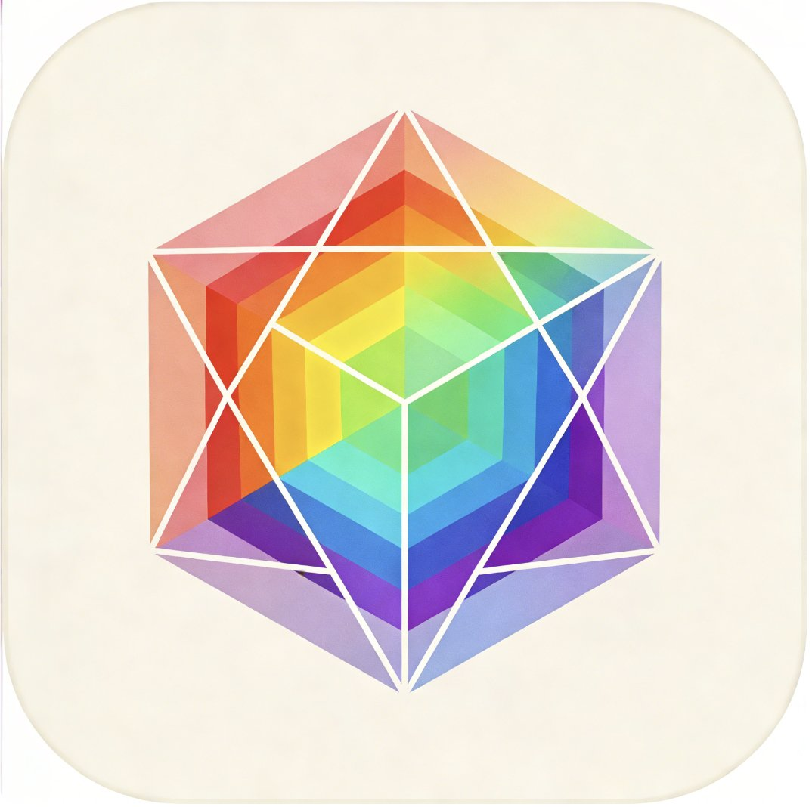</td>
<td>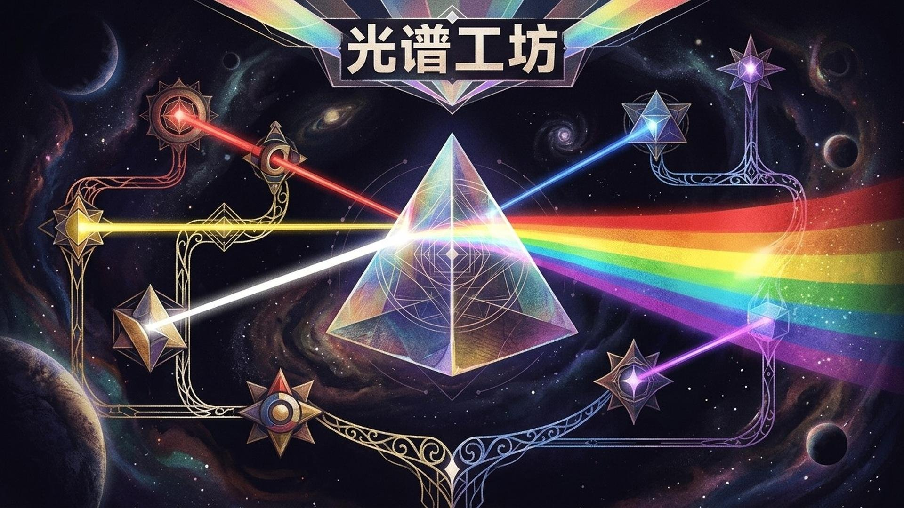</td>
<td>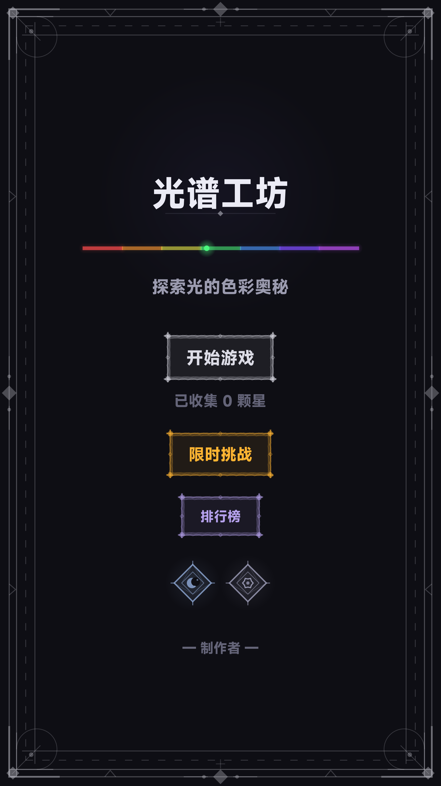</td>
</tr>
<tr>
<td>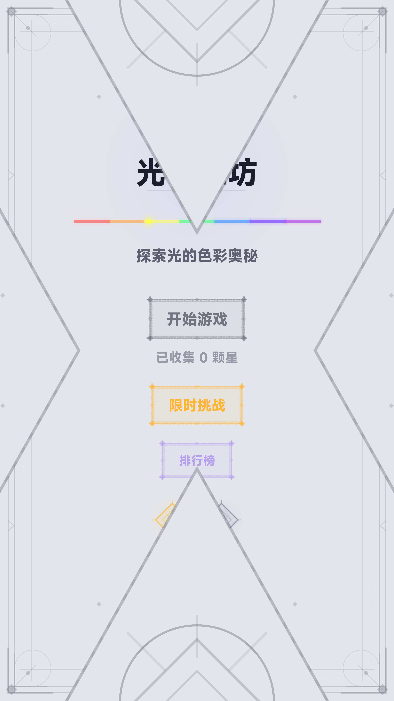</td>
<td>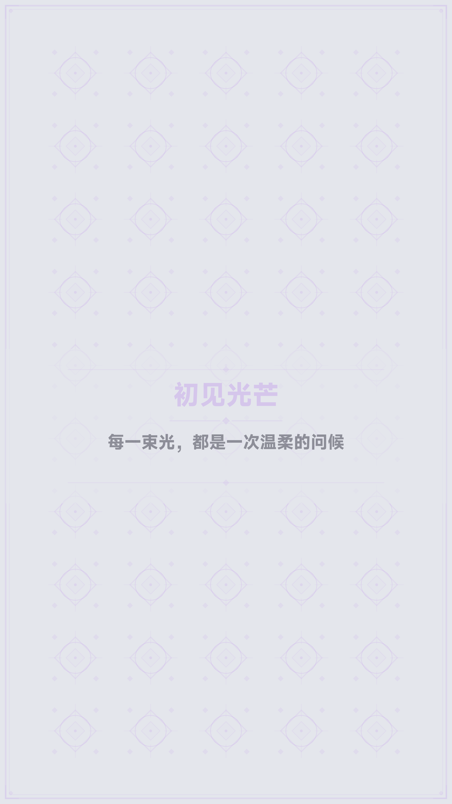</td>
<td>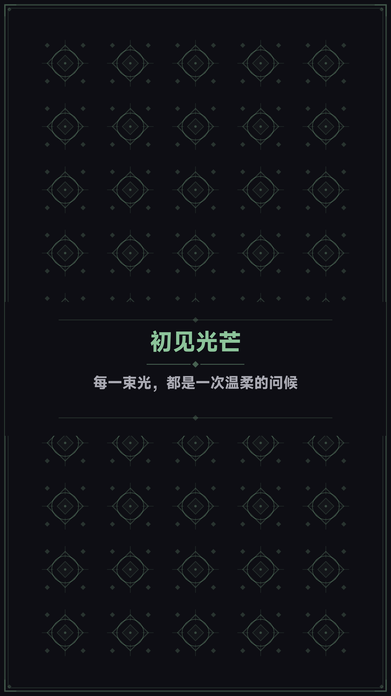</td>
</tr>
<tr>
<td>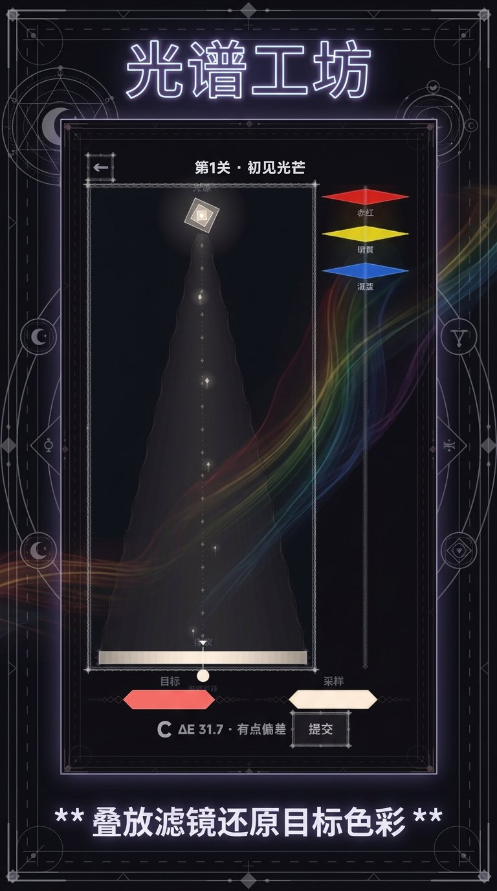</td>
<td>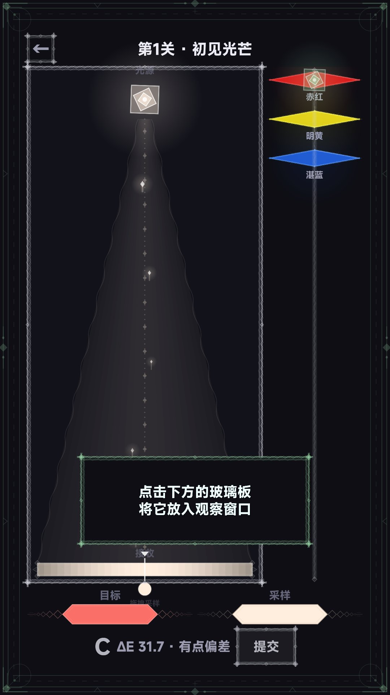</td>
<td>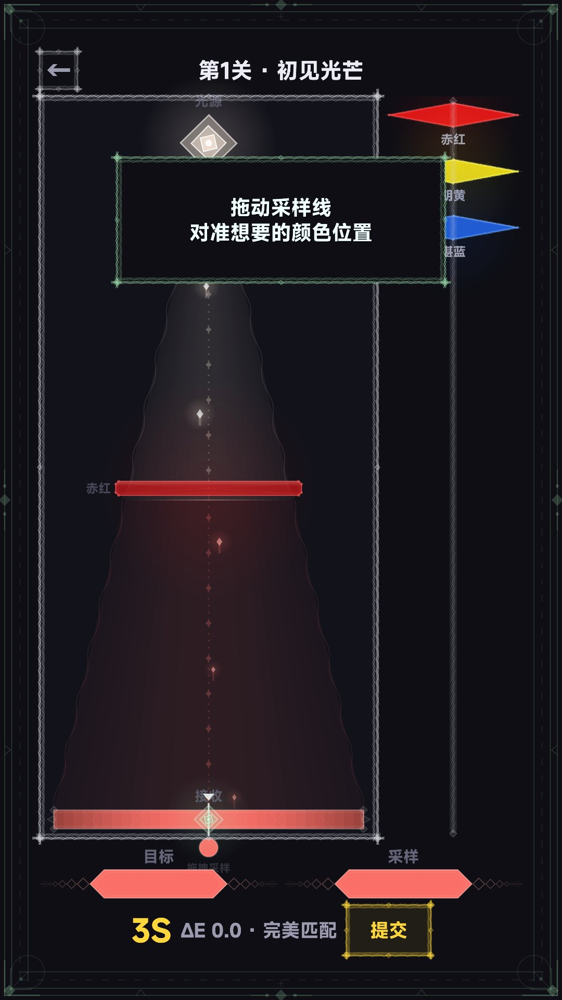</td>
</tr>
<tr>
<td>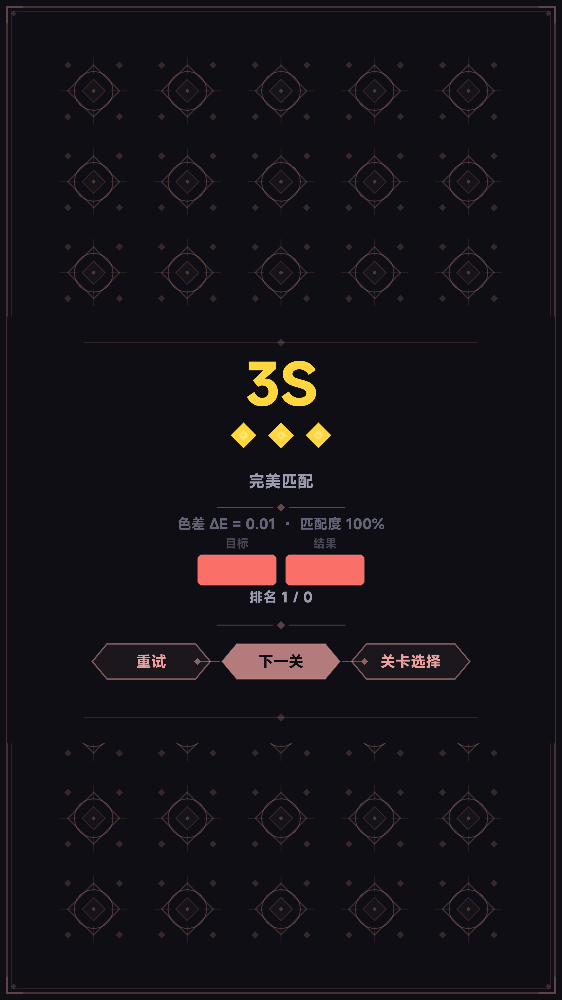</td>
<td>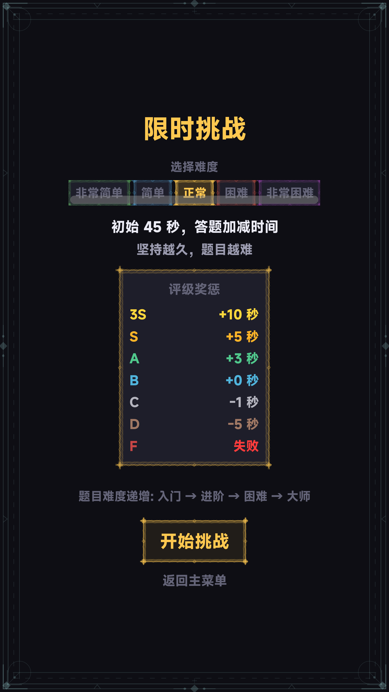</td>
<td>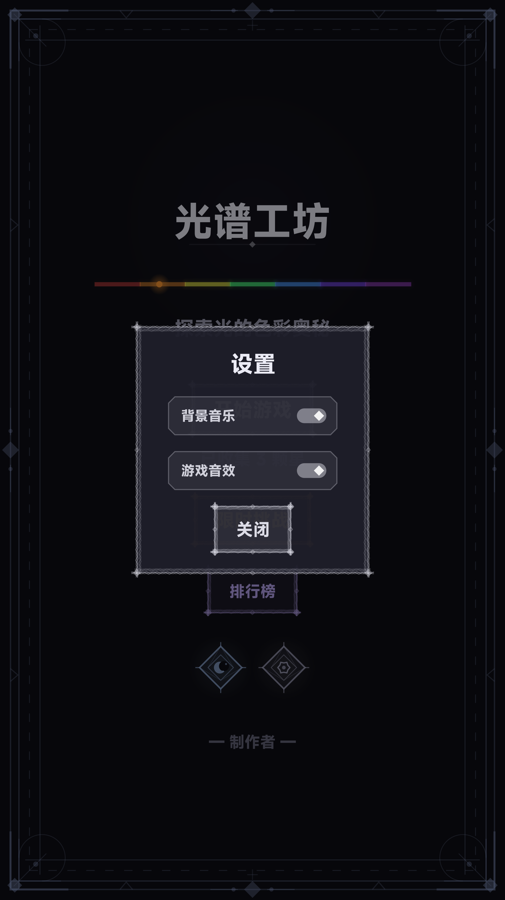</td>
</tr>
</table>

> 🎮 **演示视频**：[demo.mp4](assets/video/demo.mp4)

## 游戏概览

**光谱工坊**是一款以光学色彩科学为核心机制的益智解谜游戏。玩家扮演一位光谱调色师，通过调节光源参数（强度和色温）、选择并叠加不同颜色的玻璃滤片，将光线调配成目标颜色。

游戏的核心乐趣在于：每一次"接近目标色"都基于真实的色彩科学——Beer-Lambert 光衰减定律和 CIEDE2000 色差公式。不是粗暴的 RGB 混合，而是符合人眼感知的精确色彩匹配。这让每一个高评分都带着"科学实验成功"的成就感。

游戏提供 12 个精心设计的关卡（从"晨曦微光"到"永夜绽放"），以及 4 档难度的限时挑战模式，配合云端排行榜系统，兼顾休闲探索与硬核竞速。

## 核心玩法

### 调色实验台

- **光源控制**：调节光源强度（0.1–2.0）和色温（1000K–10000K），改变照射光的基础颜色
- **玻璃滤片**：从 16 种预制玻璃中选择，通过拖拽叠加到光路中
- **叠加顺序**：玻璃的叠放顺序影响最终结果（非交换律），策略性极强
- **实时预览**：每片玻璃的过滤效果实时可视化，展示中间步骤的颜色变化

### 评分系统

使用 CIEDE2000 色差值（ΔE）作为评分依据：

| 等级 | ΔE 范围 | 含义 |
|------|---------|------|
| 3S | < 2 | 肉眼无法区分 |
| S | < 5 | 极其接近 |
| A | < 10 | 轻微差异 |
| B | < 20 | 可察觉差异 |
| C | < 35 | 明显差异 |
| D | < 50 | 较大差异 |

### 限时挑战

4 个难度档位（入门/进阶/困难/大师），随机生成可解谜题，越快越准得分越高，与全球玩家在排行榜上竞争。

## 技术实现

### 引擎与框架

- **引擎**：UrhoX（Lua 5.4 脚本驱动）
- **渲染**：纯 NanoVG 2D 矢量渲染管线（无 3D Scene/Viewport）
- **UI**：UrhoX UI 组件库（Yoga Flexbox 布局）
- **音频**：引擎内置 Audio 子系统 + 自定义 AudioManager
- **云服务**：clientCloud API（云变量 + 排行榜）

### 技术亮点

#### 1. 完整的色彩科学管线

从物理光学到感知色彩空间的完整转换链路：

```lua
-- Beer-Lambert 定律：玻璃滤色模拟
-- 密度(density) = alpha * thickness，模拟玻璃的吸收特性
function ColorScience.applyGlassFilter(linearRGB, glass)
    local density = glass.alpha * glass.thickness
    -- 透射率 T = glass_color ^ density（指数衰减）
    local gr, gg, gb = ColorScience.hsvToRGB(glass.h, glass.s, glass.v)
    return {
        linearRGB[1] * (gr ^ density),
        linearRGB[2] * (gg ^ density),
        linearRGB[3] * (gb ^ density)
    }
end
```

实现了 sRGB ↔ Linear RGB ↔ XYZ ↔ CIE L\*a\*b\* 完整转换管线，以及 CIEDE2000 色差计算（Sharma 2005 论文实现，含旋转项修正）。

#### 2. 黑体辐射色温模拟

基于 Tanner Helland 近似公式，将色温（1000K–10000K）映射为 RGB 值：

```lua
-- 色温 → RGB（黑体辐射近似）
function ColorScience.temperatureToRGB(kelvin)
    local temp = kelvin / 100
    local r, g, b
    if temp <= 66 then
        r = 255
        g = 99.4708025861 * math.log(temp) - 161.1195681661
    else
        r = 329.698727446 * ((temp - 60) ^ (-0.1332047592))
        g = 288.1221695283 * ((temp - 60) ^ (-0.0755148492))
    end
    -- ...
end
```

#### 3. 自定义塔罗牌边框渲染

使用 NanoVG 程序化生成精美的塔罗牌风格装饰边框，用于玻璃选择面板和结算界面：

```lua
-- 贝塞尔曲线圆角 + 渐变描边 + 内发光效果
nvgBeginPath(vg)
nvgRoundedRect(vg, x, y, w, h, radius)
local paint = nvgLinearGradient(vg, x, y, x, y + h,
    theme.borderGradientTop, theme.borderGradientBottom)
nvgStrokePaint(vg, paint)
nvgStrokeWidth(vg, 2.0)
nvgStroke(vg)
```

#### 4. 撤销系统与状态快照

支持最多 20 步撤销，每次操作自动保存完整实验状态快照：

```lua
function GameState.pushUndo()
    local snapshot = {
        lightIntensity = state.lightIntensity,
        lightTemperature = state.lightTemperature,
        glassStack = deepCopy(state.glassStack),
        sampleY = state.sampleY
    }
    table.insert(state.undoHistory, snapshot)
    if #state.undoHistory > MAX_UNDO then
        table.remove(state.undoHistory, 1)
    end
end
```

## 架构设计

### 项目结构

```
scripts/
├── main.lua              # 入口：生命周期、屏幕切换、幕布动画
├── Config.lua            # 配置中心：关卡/玻璃/主题/评分
├── ColorScience.lua      # 色彩科学：CIEDE2000/Beer-Lambert/黑体辐射
├── GameState.lua         # 状态管理：实验状态/存档/排行榜
├── RandomMode.lua        # 限时挑战：随机谜题生成/难度曲线
├── AudioManager.lua      # 音频系统：BGM/SFX/增益控制
├── screens/              # 屏幕模块（6个独立页面）
│   ├── Menu.lua          #   主菜单
│   ├── LevelSelect.lua   #   关卡选择
│   ├── Playing.lua       #   游戏主界面（核心交互）
│   ├── Result.lua        #   结算界面
│   ├── Race.lua          #   限时挑战
│   └── Leaderboard.lua   #   排行榜
├── widgets/              # 可复用 UI 组件（9个）
│   ├── Curtain.lua       #   幕布过渡动画
│   ├── DrawHelpers.lua   #   NanoVG 绘制工具集
│   ├── GlassDiamond.lua  #   玻璃钻石卡片
│   ├── DiamondSwatch.lua #   色彩样本钻石
│   ├── Sliders.lua       #   自定义滑块控件
│   ├── TarotBorder.lua   #   塔罗牌装饰边框
│   ├── CommonButtons.lua #   通用按钮组件
│   ├── RaceWidgets.lua   #   竞速模式专用组件
│   └── SettlementOverlay.lua # 结算弹层
└── Tutorial.lua          # 新手引导系统
```

### 模块职责划分

| 层级 | 模块 | 职责 |
|------|------|------|
| **数据层** | Config, GameState | 配置定义、状态管理、持久化 |
| **算法层** | ColorScience, RandomMode | 核心算法、谜题生成 |
| **表现层** | screens/*, widgets/* | UI 渲染、交互响应 |
| **基础设施** | main, AudioManager, Tutorial | 生命周期、音频、引导 |

### 设计模式

- **Screen Pattern**：每个界面是独立模块，通过 `main.lua` 的幕布动画系统切换
- **State Snapshot**：撤销系统使用完整快照而非命令模式，实现简洁且可靠
- **Forward Computation**：随机谜题先生成解法再反推目标，保证 100% 可解
- **Observer**：状态变更通过事件驱动 UI 刷新

## 开发数据

| 指标 | 数据 |
|------|------|
| 代码总行数 | 11,994 行 |
| 脚本文件数 | 25 个 |
| 资源文件数 | 20 个（音频 + 图片） |
| 屏幕模块 | 6 个 |
| 可复用组件 | 9 个 |
| 预制关卡 | 12 个 |
| 玻璃种类 | 16 种 |
| 挑战难度 | 4 档 |
| 发布版本 | v1.0.8 |

## 开发心得

### 1. 科学准确性 vs 游戏体验的平衡

色彩科学的精确实现（CIEDE2000 含旋转项、完整的色彩空间转换管线）为游戏提供了坚实的"真实感"基础。但在关卡设计中，需要刻意控制 ΔE 的可达范围——太容易达到 3S 评级会让游戏缺乏挑战，太难则令人沮丧。最终通过手工调试 12 个关卡的参数组合，找到了"有挑战但可达成"的甜区。

### 2. 程序化生成的可解性保证

限时挑战模式的谜题生成采用"正向计算"策略：先随机选择光源参数和玻璃组合计算出结果色，再将该结果色作为目标呈现给玩家。这保证了每个谜题必然存在精确解。同时加入质量校验（排除过暗/过亮的目标色），避免生成"虽然有解但体验糟糕"的谜题。

### 3. NanoVG 矢量渲染的取舍

选择纯 NanoVG 渲染而非精灵/贴图方案，使得所有 UI 元素（玻璃钻石、滑块、边框装饰）在任意分辨率下都保持锐利。代价是 `DrawHelpers.lua`（805 行）和 `Curtain.lua`（1200 行）等绘制模块的复杂度较高，但换来了完全可控的视觉表现力和零贴图依赖。
